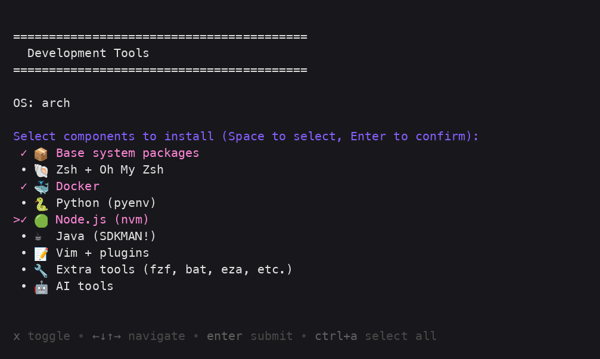

# My Shell Config

Development environment setup for **Arch Linux**, **Debian/Ubuntu**, and **macOS**.

## Quick Start

```bash
./install.sh
```

This launches an interactive menu (powered by [gum](https://github.com/charmbracelet/gum), auto-installed if missing) where you select which components to install. Mark items with **Space**, then press **Enter** to confirm — pressing Enter without marking anything re-prompts instead of exiting. If gum can't be installed, a plain text fallback menu is used instead.



## Components

| Component | Description |
|-----------|-------------|
| Base system packages | git, curl, wget, jq, build tools |
| Zsh + Oh My Zsh | Shell with plugins |
| Docker | Engine + Compose |
| Python (pyenv) | Version management |
| Node.js (nvm) | Version management |
| Java (SDKMAN!) | JDK + build tools |
| Vim + plugins | Editor + vim-plug plugins |
| Extra tools | fzf, bat, eza, ripgrep, fd, lazygit, btop |
| AI tools | GitHub Copilot CLI, opencode, Cursor (optional) |

`scripts/editors/10-ide.sh` (VS Code, Neovim) is not in the installer menu yet — run it directly:

```bash
./scripts/editors/10-ide.sh
```

## Supported OS

- **Arch Linux** (pacman + yay for AUR)
- **Debian / Ubuntu** (apt)
- **macOS** (Homebrew)

## Manual Setup

You can also run individual scripts:

```bash
./scripts/base/01-base.sh
./scripts/shell/02-zsh.sh
./scripts/containers/03-docker.sh
# ... etc
```

## Config Files

Symlinked to your home directory:

- `configs/.zshrc` - Zsh configuration
- `configs/.zsh_aliases` - Custom aliases
- `configs/.gitconfig` - Git configuration template
- `configs/.vimrc` - Vim configuration

## Plugins

### Zsh
- zsh-autosuggestions
- zsh-syntax-highlighting
- zsh-completions

### Vim
- NERDTree - File explorer
- vim-fugitive - Git integration
- coc.nvim - IntelliSense engine
- vim-airline - Status bar
- vim-surround - Surround text objects
